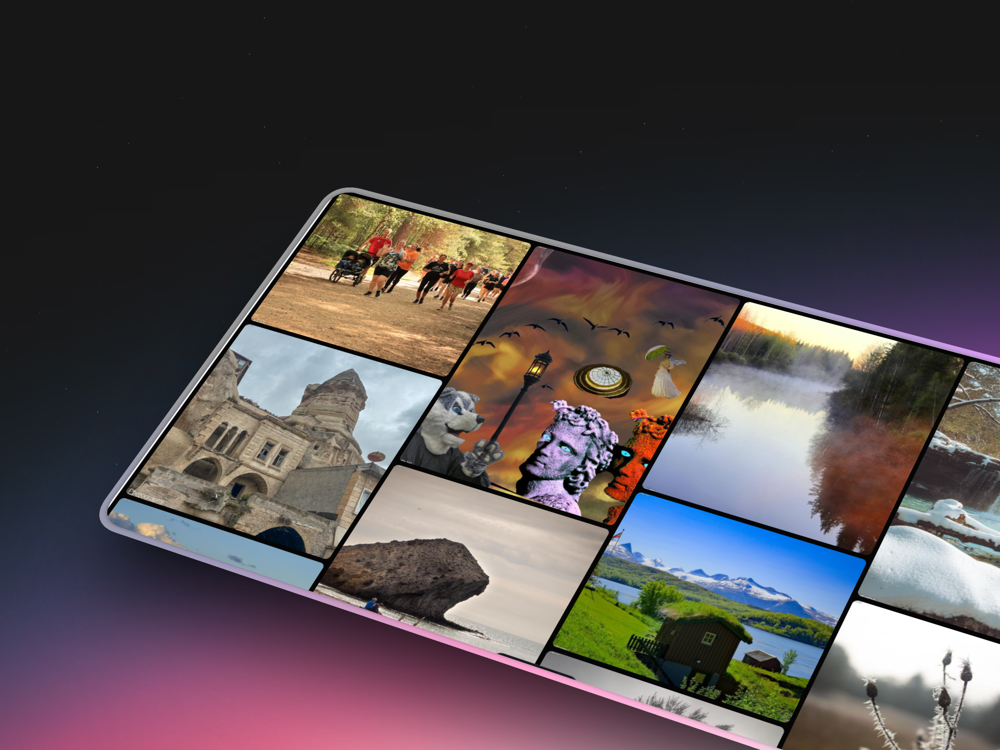

# Masonry 🖼️ 🌌 ♾️ 🎨 ⚡

Photo gallery with a masonry grid layout built with **Astro 6** and **Vanilla CSS**. Loads images in batches via infinite scroll using the Intersection Observer API, with staggered entrance animations and a responsive dark mode design.



## ✨ Features

- **Premium Design**: Dark mode aesthetic with glassmorphism and modern typography.
- **Responsive Masonry**: Fluid multi-column layout that adapts to all screen sizes.
- **Infinite Scroll**: Images load in batches using the Intersection Observer API.
- **Dynamic Animations**: Smooth staggered entrance transitions and hover effects.
- **Modern Tech Stack**: Astro 6, Tailwind CSS 4, and Vanilla CSS.

## 🚀 Getting Started

1. **Install dependencies**:
   ```bash
   npm install
   ```

2. **Start the development server**:
   ```bash
   npm run dev
   ```

3. **Build for production**:
   ```bash
   npm run build
   ```

## 📂 Project Structure

- `src/pages/index.astro`: Main page with the masonry grid and infinite scroll logic.
- `src/styles/global.css`: Global styles including Tailwind 4 integration and custom design system.
- `public/`: Static assets including the preview image.

---
Construido con ❤️ por Sebastian Vasquez
